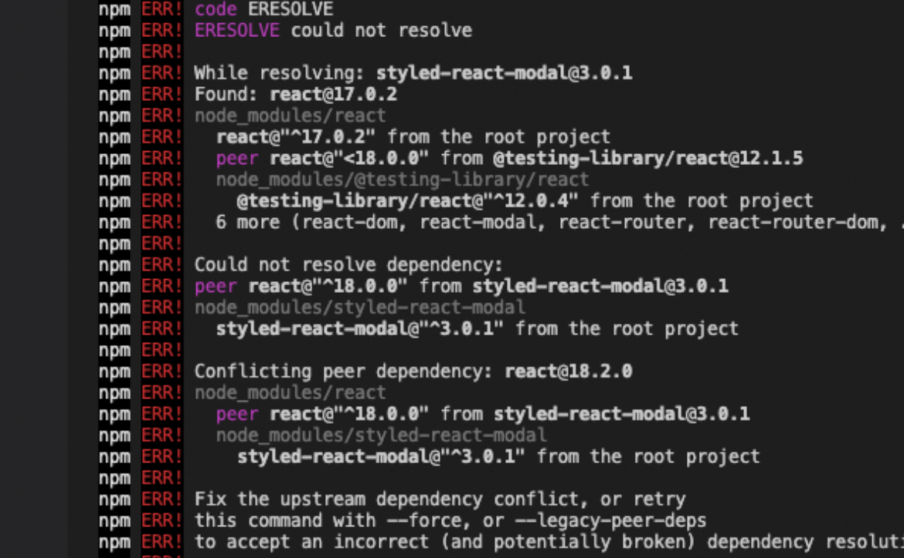
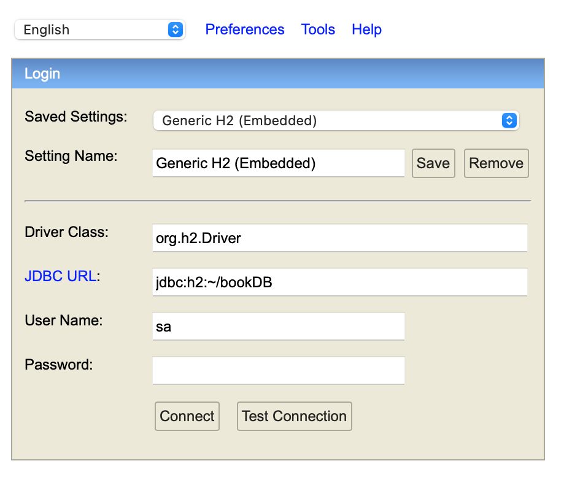

# Book'd & Rate'd

Book'd & Rate'd is a web application where users are provided a platform to track their reading history as well as leave reviews for various books. After creating an account, the user can create a list of books read or plan to read and/or leave reviews on each book.  

## Project Board
Link to [project board](https://trello.com/b/YncmQM2F/sprint)

## Installation
1. Install node through [this link](https://nodejs.org/en/) if it isn't downloaded on device already

2. Install dependencies under package.json found in front-end folder with `npm install`

>  __NOTE__: Material UI v5 was used on the frontend and only works with React 17.0.2. There will be an error with any version of React 18 and above. Currently, the issue has yet to be resolved by the developers of Material UI.

> If the above error appears enter `npm config set legacy-peer-deps true` and `npm i`.
> The error is caused by the incompatibilities of the dependencies.

## How to Run
1. Run the BookReviewApp (the backend)
2. `npm start`
>__Note__: The backend needs to be running in order for the frontend to run properly. Frontend runs on port 3000 while backend runs on port 8080.


## Accessing the Database
1. Run the BookReviewApp file
2. Access the database through localhost:8080/h2-console
3. Ensure JDBC URL:`jdbc:h2~/bookDB`


4. Enter `123` as the password

## Testing Instructions:
1. To test our program, go to the "Releases" tab on the right side of this GitHub page and download the executable JAR file. 
2. Go to your command-line and cd into the directory where the JAR file is downloaded.
3. Run the following command to start up the server for our backend API.
  ```
  java -jar <filename>.jar
  ```
4. Once the server is started, you can go to our GitHub pages site in order to view an interactable frontend to test the endpoints and the database running on the server.

Link to GitHub pages site: https://cis3296f22.github.io/705-bookreview-app/

**NOTE:** The server must be running (Step 1 - 3) in order for the frontend to properly function!
